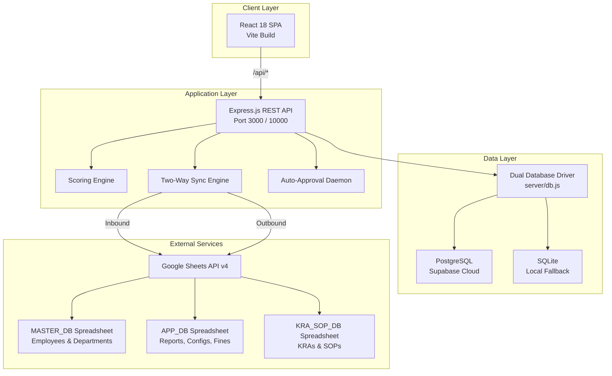
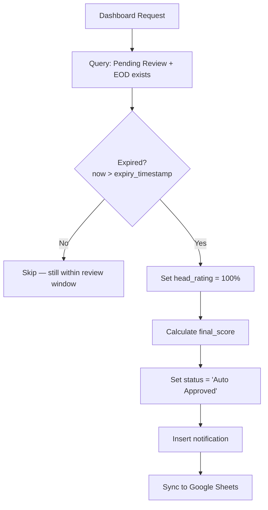
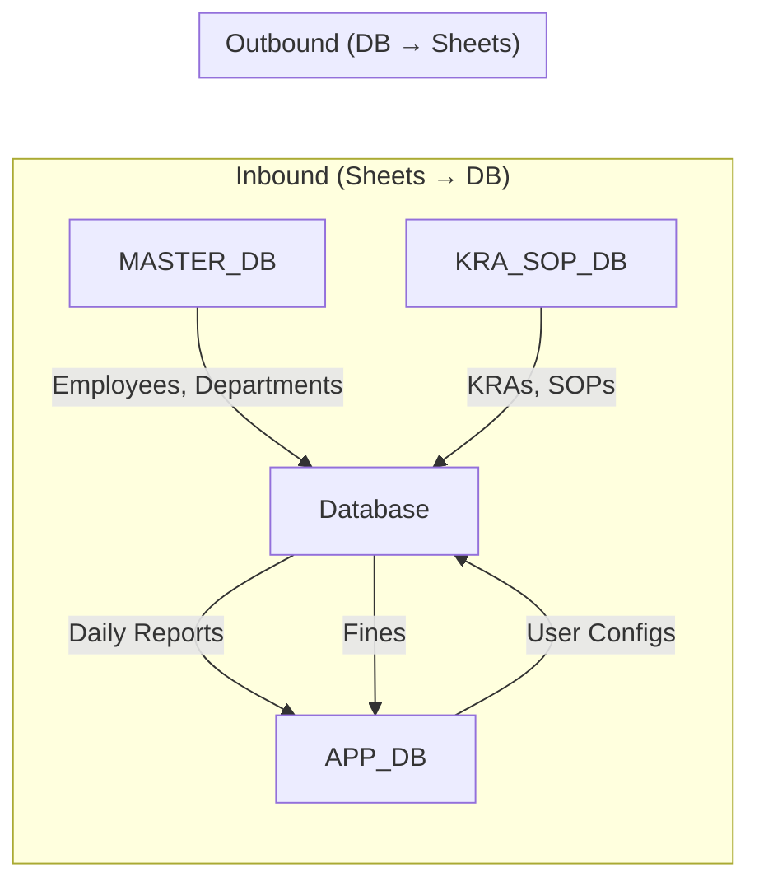
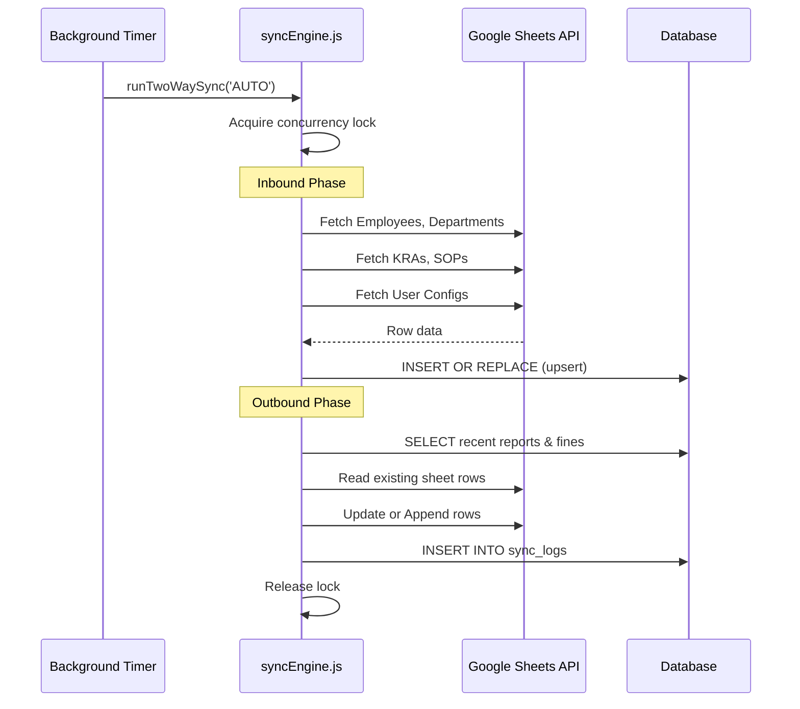
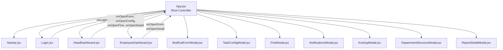
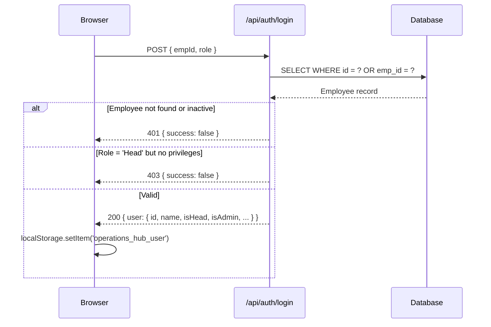
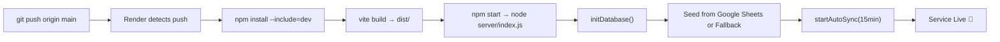
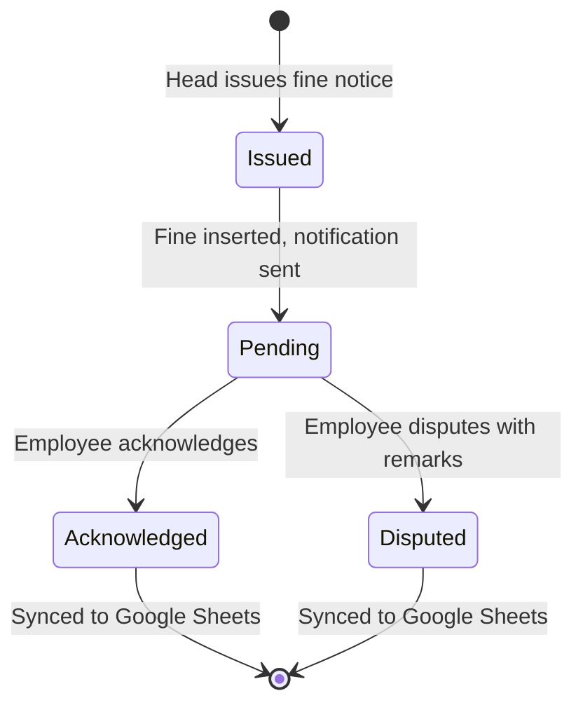

# Technical Design Document
## BOD & EOD Daily Operations Hub

**Version**: 1.0  
**Last Updated**: 26 August 2026  
**Repository**: [Happybhai329/eod-bod-fullstack](https://github.com/Happybhai329/eod-bod-fullstack)  
**Live URL**: [eod-bod-operations-hub.onrender.com](https://eod-bod-operations-hub.onrender.com)

---

## 1. Executive Summary

The **Daily Operations Hub** is a full-stack web application for managing daily employee performance through structured Morning (BOD) and Evening (EOD) reporting workflows. The system automates performance scoring, enables manager review and rating with a multiplier system, enforces 24-hour auto-approval windows, manages disciplinary fine notices, and maintains bidirectional real-time synchronization between the primary database and Google Sheets.

---

## 2. System Architecture



### 2.1 Technology Stack

| Layer | Technology | Version |
|---|---|---|
| Frontend | React + Vite | 18.3 / 5.4 |
| Icons | Bootstrap Icons (CDN) | 1.11.3 |
| Typography | Google Fonts (Inter) | 300–800 |
| Backend | Express.js | 4.21 |
| Cloud Database | PostgreSQL via `pg` | 8.23 |
| Local Database | SQLite3 | 5.1.7 |
| Sheets Integration | Google APIs (googleapis) | 174.0 |
| Module System | ES Modules (`"type": "module"`) | — |
| Runtime | Node.js | 24.x |
| Deployment | Render (Free Tier) | — |

---

## 3. Project Directory Structure

```
eod-bod-full-stack/
├── index.html                    # SPA entry point (Inter font, Bootstrap Icons)
├── package.json                  # Dependencies & scripts
├── render.yaml                   # Render deployment blueprint
├── vite.config.js                # Vite dev server & API proxy config
│
├── server/
│   ├── index.js                  # Express REST API & business logic (37.6 KB)
│   ├── db.js                     # Dual database engine & migrations (23.3 KB)
│   ├── googleSheets.js           # Google Sheets API integration (17.4 KB)
│   ├── syncEngine.js             # Bidirectional sync engine (9.4 KB)
│   ├── scoringEngine.js          # Performance scoring algorithms (4.5 KB)
│   ├── credentials.example.json  # GCP credential template
│   └── database.sqlite           # Local fallback database
│
├── src/
│   ├── main.jsx                  # React DOM mount
│   ├── App.jsx                   # Root controller, state & modals (8.2 KB)
│   ├── components/
│   │   ├── Login.jsx             # Authentication UI (9.7 KB)
│   │   ├── Navbar.jsx            # Navigation & view switcher (3.1 KB)
│   │   ├── HeadDashboard.jsx     # Manager dashboard & sync (20.2 KB)
│   │   ├── EmployeeDashboard.jsx # Employee workday portal (19.7 KB)
│   │   ├── BodEodFormModal.jsx   # Dynamic BOD/EOD form (19.6 KB)
│   │   ├── TaskConfigModal.jsx   # Task template builder (7.4 KB)
│   │   ├── FineModal.jsx         # Fine issuance dialog (3.6 KB)
│   │   ├── NotificationsModal.jsx# Notification drawer (3.0 KB)
│   │   ├── KraSopModal.jsx       # KRA & SOP search (6.3 KB)
│   │   ├── DepartmentStructureModal.jsx # Hierarchy admin (7.9 KB)
│   │   └── ReportDetailModal.jsx # Report breakdown viewer (8.4 KB)
│   └── styles/
│       └── main.css              # Design system & CSS variables (9.5 KB)
│
└── test/
    ├── api.test.js               # 6 integration tests
    ├── scoringEngine.test.js     # 9 unit tests
    └── sync.test.js              # 2 sync engine tests
```

---

## 4. Database Design

### 4.1 Dual-Engine Architecture

The database layer ([server/db.js](file:///d:/prime/eod%20bod%20full%20stack/server/db.js)) dynamically selects between two engines at startup:

| Condition | Engine | Connection |
|---|---|---|
| `DATABASE_URL` env var present | **PostgreSQL** (Supabase Cloud) | `pg.Pool` with SSL (`rejectUnauthorized: false`) |
| `DATABASE_URL` absent | **SQLite3** (Local Fallback) | `server/database.sqlite` file |

### 4.2 SQL Dialect Translation

Since SQLite uses `INSERT OR REPLACE` and PostgreSQL uses `ON CONFLICT ... DO UPDATE`, the driver includes an automatic SQL rewriter:

- **`formatSql(sql)`** — Rewrites `?` placeholders to `$1, $2, ...` for PostgreSQL
- **`transformInsertOrReplace(sql)`** — Converts `INSERT OR REPLACE INTO table (cols) VALUES (?)` into `INSERT INTO "table" (cols) VALUES ($1) ON CONFLICT ("key") DO UPDATE SET col = EXCLUDED.col`

**Conflict key mapping:**

| Table | Conflict Keys |
|---|---|
| `departments` | `name` |
| `employees` | `id` |
| `user_configs` | `employee_id` |
| `daily_reports` | `date, employee_id` |
| `fines` | `id` |
| `notifications` | `id` |
| `kras` | `id` |
| `sops` | `id` |
| `sync_logs` | `id` |

### 4.3 Schema Specification

#### `departments`
| Column | Type | Constraints | Description |
|---|---|---|---|
| `name` | TEXT | PRIMARY KEY | Department name |
| `parent` | TEXT | | Parent department (NULL = top-level) |
| `head_id` | TEXT | | Employee ID of department head |
| `head_name` | TEXT | | Display name of head |
| `is_main` | INTEGER | DEFAULT 1 | Whether this is a main department |

#### `employees`
| Column | Type | Constraints | Description |
|---|---|---|---|
| `id` | TEXT | PRIMARY KEY | Internal UUID |
| `emp_id` | TEXT | | Human-readable employee code (e.g. `TPC2423SB`) |
| `name` | TEXT | NOT NULL | Full name |
| `department` | TEXT | NOT NULL | Primary department |
| `sub_department` | TEXT | | Sub-department assignment |
| `other_department` | TEXT | | Cross-department membership |
| `designation` | TEXT | | Job title |
| `role` | TEXT | NOT NULL | Access role |
| `status` | TEXT | DEFAULT 'active' | `active` or `resigned` |
| `contact` | TEXT | | Phone number |

#### `daily_reports`
| Column | Type | Constraints | Description |
|---|---|---|---|
| `id` | SERIAL/INTEGER | PRIMARY KEY | Auto-increment |
| `date` | TEXT | NOT NULL, UNIQUE(date, employee_id) | Report date (`DD/MM/YYYY`) |
| `employee_id` | TEXT | NOT NULL | Employee reference |
| `department` | TEXT | NOT NULL | Department at time of report |
| `bod_data` | TEXT | | Morning plan (JSON) |
| `eod_data` | TEXT | | Evening execution (JSON) |
| `system_score` | REAL | | Algorithm-computed score (0–100) |
| `head_rating` | REAL | | Manager multiplier (0–200) |
| `final_score` | REAL | | Composite score (0–200) |
| `attendance` | TEXT | | `Present`, `Late`, `Absent` |
| `overtime` | REAL | | Extra hours worked |
| `approval_status` | TEXT | | `Pending Review`, `Approved`, `Auto Approved` |
| `expiry_timestamp` | TEXT | | Auto-approval deadline |
| `rated_by` | TEXT | | Reviewer identity |
| `fine_amount` | REAL | | Embedded fine amount |
| `fine_reason` | TEXT | | Embedded fine reason |
| `employee_remarks` | TEXT | | Employee's response to fine |

#### `fines`
| Column | Type | Constraints | Description |
|---|---|---|---|
| `id` | TEXT | PRIMARY KEY | Unique fine ID (`F<timestamp>_<rand>`) |
| `employee_id` | TEXT | NOT NULL | Target employee |
| `date` | TEXT | NOT NULL | Date of infraction |
| `amount` | REAL | NOT NULL | Penalty amount (₹) |
| `reason` | TEXT | NOT NULL | Infraction description |
| `status` | TEXT | DEFAULT 'Pending' | `Pending`, `Acknowledged`, `Disputed`, `Paid` |
| `doc_url` | TEXT | | Printable notice URL |
| `issued_by` | TEXT | | Issuing authority name |
| `employee_remarks` | TEXT | | Employee response text |

#### `user_configs`
| Column | Type | Constraints | Description |
|---|---|---|---|
| `employee_id` | TEXT | PRIMARY KEY | Employee reference |
| `config_json` | TEXT | NOT NULL | JSON array of task definitions |
| `last_updated` | TEXT | NOT NULL | ISO timestamp |

#### `kras` & `sops`
| Table | Primary Key | Key Columns |
|---|---|---|
| `kras` | `id` | `position_name`, `text`, `type`, `timestamp` |
| `sops` | `id` | `kra_id`, `text`, `checklist`, `form_fields`, `doc_link` |

#### `notifications`
| Column | Type | Constraints | Description |
|---|---|---|---|
| `id` | TEXT | PRIMARY KEY | Unique notification ID |
| `employee_id` | TEXT | NOT NULL | Target employee |
| `type` | TEXT | | Category (`Approved`, `Fine Issued`, etc.) |
| `message` | TEXT | | Notification body |
| `read` | INTEGER | DEFAULT 0 | Read status flag |

#### `sync_logs`
| Column | Type | Constraints | Description |
|---|---|---|---|
| `id` | TEXT | PRIMARY KEY | Unique log ID |
| `started_at` | TEXT | | Sync start timestamp |
| `completed_at` | TEXT | | Sync end timestamp |
| `direction` | TEXT | | `INBOUND`, `OUTBOUND`, `BIDIRECTIONAL` |
| `status` | TEXT | | `SUCCESS`, `FAILED` |
| `summary` | TEXT | | JSON summary of records synced |
| `error_message` | TEXT | | Error details if failed |

### 4.4 Schema Migration & Column Alignment

On PostgreSQL startup, the system runs `ALTER TABLE ... ADD COLUMN IF NOT EXISTS` followed by `UPDATE ... SET col = COALESCE(col, "camelCaseCol")` to align the Supabase pre-existing camelCase columns (`employeeId`, `departmentName`, `headId`, `subDepartment`) with the application's snake_case convention.

---

## 5. API Specification

### 5.1 Key Constants

| Constant | Value | Purpose |
|---|---|---|
| `REVIEW_WINDOW_MS` | 86,400,000 (24h) | Auto-approval deadline after EOD submission |
| `BOD_EDIT_WINDOW_MS` | 36,000,000 (10h) | BOD edit grace period |
| `EOD_EDIT_WINDOW_MS` | 14,400,000 (4h) | EOD edit grace period |
| `DEFAULT_HEAD_RATING` | 100 | Neutral multiplier for auto-approvals |

### 5.2 Endpoints

#### Health & Diagnostics
| Method | Path | Description |
|---|---|---|
| `GET` | `/api/health` | Returns uptime, timestamp, DB status, employee count |

#### Authentication
| Method | Path | Body | Description |
|---|---|---|---|
| `POST` | `/api/auth/login` | `{ empId, role }` | Authenticates via `id` or `emp_id`, resolves Head/Admin privileges |

#### Employee Report Lifecycle
| Method | Path | Description |
|---|---|---|
| `GET` | `/api/employee/:id/form` | Today's status, task config, edit windows |
| `POST` | `/api/employee/:id/report` | Submit BOD plan or EOD execution |
| `GET` | `/api/employee/:id/dashboard` | Performance history, fines, filtered metrics |

#### Head / Manager Operations
| Method | Path | Description |
|---|---|---|
| `GET` | `/api/head/dashboard` | Team metrics, reports, managed employees |
| `POST` | `/api/head/rate` | Approve and rate an employee's EOD report |

#### Task Configuration
| Method | Path | Description |
|---|---|---|
| `GET` | `/api/config/:id` | Fetch employee task template |
| `POST` | `/api/config/:id` | Save customized task definitions |

#### Fine Management
| Method | Path | Description |
|---|---|---|
| `GET` | `/api/fines` | List fines (filter by `empId` or `headId`) |
| `POST` | `/api/fines/issue` | Issue disciplinary fine notice |
| `POST` | `/api/fines/status` | Update fine status (Acknowledge/Dispute) |
| `GET` | `/api/fines/:id/document` | Render printable HTML fine notice |

#### Notifications
| Method | Path | Description |
|---|---|---|
| `GET` | `/api/notifications/:id` | Fetch user notifications |
| `POST` | `/api/notifications/:id/read` | Mark all as read |

#### Knowledge Base
| Method | Path | Description |
|---|---|---|
| `GET` | `/api/kras` | Search KRAs (multi-field, case-insensitive) |
| `GET` | `/api/sops/:kraId` | Get SOPs for a specific KRA |

#### Organization Structure
| Method | Path | Description |
|---|---|---|
| `GET` | `/api/hierarchy` | Full department tree + active employees |
| `POST` | `/api/structure/assign` | Assign sub-department head (Admin only) |
| `POST` | `/api/structure/remove` | Remove sub-department head (Admin only) |

#### Synchronization
| Method | Path | Description |
|---|---|---|
| `GET` | `/api/sync/status` | Current sync state, last run time, configuration |
| `POST` | `/api/sync/trigger` | Trigger on-demand two-way sync |

### 5.3 Auto-Approval Mechanism

`checkAutoApprovals()` is invoked on every dashboard request:



---

## 6. Scoring Engine

The scoring engine ([server/scoringEngine.js](file:///d:/prime/eod%20bod%20full%20stack/server/scoringEngine.js)) evaluates daily performance by comparing BOD planned targets against EOD actual execution.

### 6.1 Task Types & Scoring Logic

| Task Type | BOD Input | EOD Input | Score Formula |
|---|---|---|---|
| `number` | Target value | Achieved value | $\frac{\text{achieved}}{\text{target}} \times 100$ |
| `checkbox` | Task listed | `Done` / `Pending` | 100 if Done, 0 if Pending |
| `categoryNumber` | Category targets | Category actuals | $\frac{\sum \text{achieved}_i}{\sum \text{target}_i} \times 100$ |
| `dynamicList` | Item list + targets | Item achievements | $\frac{\sum \text{achieved}_i}{\sum \text{target}_i} \times 100$ (voluntary items add to achieved but not target) |

### 6.2 System Score Formula

$$\text{System Score} = \text{round}\left(\frac{1}{N} \sum_{i=1}^{N} \text{clamp}\left(\text{TaskScore}_i,\ 0,\ 100\right)\right)$$

Clamped to $[0, 100]$.

### 6.3 Final Score Formula

$$\text{Final Score} = \text{round}\left(\frac{\text{System Score} \times \text{Head Rating}}{100}\right)$$

Where Head Rating operates as a multiplier:

| Head Rating | Effect | Example (System = 80%) |
|---|---|---|
| 100% | Neutral ($1.0\times$) | Final = 80% |
| 125% | Bonus ($1.25\times$) | Final = 100% |
| 150% | Superior ($1.5\times$) | Final = 120% |
| 200% | Maximum ($2.0\times$) | Final = 160% |
| 50% | Penalty ($0.5\times$) | Final = 40% |
| 0% | Zero-out | Final = 0% |

Final score is clamped to $[0, 200]$.

### 6.4 Helper Functions

| Function | Signature | Purpose |
|---|---|---|
| `clampNumber` | `(value, min, max, fallback) → number` | Type-safe numeric clamping with fallback |
| `parseScoreHelper` | `(val, maxScore?) → number` | Parses `"85%"`, `0.85`, `85`, with ceiling cap |
| `getSafeNonNegativeNumber` | `(value, fallback?) → number` | Ensures non-negative numeric result |
| `calculatePerformance` | `(bodObj, eodObj) → number` | Computes system score (0–100) |
| `calculateFinalScore` | `(sysScore, headRating) → number` | Computes final composite score (0–200) |

---

## 7. Two-Way Google Sheets Synchronization

### 7.1 Architecture

The sync engine ([server/syncEngine.js](file:///d:/prime/eod%20bod%20full%20stack/server/syncEngine.js)) maintains bidirectional data consistency between the database and three Google Spreadsheets.



### 7.2 Google Spreadsheet Registry

| Alias | Spreadsheet ID | Sheets |
|---|---|---|
| `MASTER_DB` | `1AxdiOpaij8Lnx0TV5iMhgVlADfN0LeXzwOdmbzmrlGA` | Employees, Departments |
| `APP_DB` | `1IFGc0kvv9LpbZUfEGroY8PevevJ8axdPApVrLjidlw8` | Daily_Reports, User_Configs, Fines, Notifications |
| `KRA_SOP_DB` | `1G1hzmhU-CV2XKUWSLSt1SPgCR6wmoXqwBdxFb33TSsU` | KRAs, SOPs |

**Service Account**: `eod-bod-backend@standard-gcp-project-485906.iam.gserviceaccount.com`

### 7.3 Sync Execution Flow



### 7.4 Concurrency & Scheduling

| Feature | Implementation |
|---|---|
| **Concurrency Lock** | Module-scoped `isSyncing` boolean prevents overlapping runs |
| **Auto-Sync Interval** | `setInterval` every 15 minutes |
| **Boot Sync** | `setTimeout` 10 seconds after server start |
| **Manual Trigger** | `POST /api/sync/trigger` from HeadDashboard UI |
| **Audit Trail** | Every run logged in `sync_logs` table |
| **Rate Limiting** | Outbound reads sheet once, then updates specific row ranges |

### 7.5 Credential Resolution Order

1. `GOOGLE_CREDENTIALS_JSON` env var (raw JSON or Base64)
2. `GOOGLE_SERVICE_ACCOUNT_KEY` env var
3. `server/credentials.json` local file
4. Graceful degradation (sync disabled, app continues without Sheets)

---

## 8. Frontend Architecture

### 8.1 Component Hierarchy



### 8.2 State Management

Centralized in `App.jsx` using React `useState` hooks. No external state library (Redux, Zustand, etc.) is used — the modal-driven architecture keeps state co-located.

**Session Persistence**: User session is stored in `localStorage` under key `operations_hub_user` and restored on mount via a dedicated `useEffect([], ...)`.

### 8.3 Role-Based Routing

| Condition | View Rendered |
|---|---|
| `!user` | `<Login />` |
| `user.isHead && activeView === 'team'` | `<HeadDashboard />` |
| `!user.isHead \|\| activeView === 'personal'` | `<EmployeeDashboard />` |

Head users can toggle between **"Team Review"** and **"My Workday"** views via the Navbar.

### 8.4 Dynamic Form Engine

`BodEodFormModal.jsx` dynamically generates form controls based on the employee's task configuration:

| Task Type | BOD Control | EOD Control |
|---|---|---|
| `number` | Numeric target input | Numeric achievement input |
| `checkbox` | Task label display | Done/Pending toggle |
| `categoryNumber` | Category target fields | Category achievement fields + auto-sum |
| `dynamicList` | Add/remove items, set targets | Per-item achievement, voluntary flag, completion checkbox |

In EOD mode, a **real-time live score preview** is computed and displayed with a progress bar.

### 8.5 Design System

CSS custom properties defined in [main.css](file:///d:/prime/eod%20bod%20full%20stack/src/styles/main.css):

| Token | Value | Usage |
|---|---|---|
| `--primary` | `#2563eb` | Primary actions, active states |
| `--success` | `#10b981` | Approved states, positive metrics |
| `--danger` | `#ef4444` | Fines, errors, attention required |
| `--warning` | `#f59e0b` | Pending states, caution alerts |
| `--ink` | `#0f172a` | Primary text color |
| `--surface` | `#ffffff` | Card backgrounds |
| `--canvas` | `#f1f5f9` | Page background |
| `--radius` | `12px` | Default border radius |

**Responsive Breakpoint**: `@media (max-width: 768px)` — collapses grid layouts, adjusts padding, and stretches toast alerts full-width.

---

## 9. Authentication & Authorization

### 9.1 Login Flow



### 9.2 Head/Admin Privilege Resolution

A user is flagged as `isHead` if:
- They are listed as `head_id` in any `departments` row, **OR**
- Their `role` contains `'head'`, `'admin'`, `'manager'`, or `'director'` (case-insensitive)

Admin-only operations (department head assignment/removal) additionally check for `'admin'` or `'director'` in the role string.

---

## 10. Deployment Infrastructure

### 10.1 Render Blueprint (`render.yaml`)

| Property | Value |
|---|---|
| Service Type | `web` |
| Plan | `free` |
| Runtime | `node` |
| Build Command | `npm install --include=dev && npm run build` |
| Start Command | `npm start` |
| Health Check | `GET /api/health` |

### 10.2 Environment Variables

| Variable | Required | Description |
|---|---|---|
| `NODE_ENV` | Yes | `production` on Render |
| `PORT` | Yes | `10000` on Render, `3000` locally |
| `DATABASE_URL` | Optional | PostgreSQL connection string. Omit for SQLite fallback. |
| `GOOGLE_CREDENTIALS_JSON` | Optional | GCP Service Account JSON. Omit to disable Sheets sync. |

### 10.3 Build Pipeline



### 10.4 Vite Dev Server Proxy

During local development, Vite proxies `/api/*` requests to the backend:

```javascript
server: {
  port: 5173,
  proxy: {
    '/api': { target: 'http://localhost:3000', changeOrigin: true }
  }
}
```

---

## 11. Automated Test Suite

**Framework**: Native Node.js Test Runner (`node:test`) + `node:assert/strict`  
**Total**: **17 tests across 3 files** — all passing

### 11.1 Test Coverage Summary

| Test File | Tests | Category | What It Validates |
|---|---|---|---|
| `test/api.test.js` | 6 | Integration | Date filtering, DB init, user configs, fine lifecycle, notifications, health check |
| `test/scoringEngine.test.js` | 9 | Unit | `clampNumber`, `parseScoreHelper`, `getSafeNonNegativeNumber`, performance calculation across all 4 task types, edge cases, `calculateFinalScore` boundary testing |
| `test/sync.test.js` | 2 | Integration | `getSyncStatus` structure validation, `runTwoWaySync` graceful execution |

### 11.2 Key Test Patterns

- **Boundary value analysis**: Tests 0%, 100%, 200%, negative values, and overflow inputs
- **Type coercion defense**: Tests `null`, `undefined`, `NaN`, non-numeric strings, percentage strings (`"85%"`)
- **State machine lifecycle**: Fine status transitions (`Pending → Acknowledged`), notification read states (`0 → 1`)
- **Graceful degradation**: Sync engine handles missing credentials without crashing

### 11.3 Commands

```bash
npm test                              # Run all 17 tests
node --test test/api.test.js          # Integration tests only
node --test test/scoringEngine.test.js # Scoring unit tests only
node --test test/sync.test.js         # Sync engine tests only
```

---

## 12. Security Considerations

| Area | Implementation |
|---|---|
| **Credentials** | GCP Service Account keys excluded via `.gitignore`; stored as Render environment secrets |
| **Database SSL** | PostgreSQL connections use SSL with `rejectUnauthorized: false` for Supabase compatibility |
| **Input Validation** | Employee IDs validated against database; role escalation checked server-side |
| **Admin Gates** | Department structure mutations require `admin` or `director` role verification |
| **CORS** | Enabled for all origins (appropriate for SPA deployment on same-origin Render) |
| **Payload Limits** | Express JSON body parser limited to 10MB |
| **Report Locking** | Approved/Auto-Approved reports are immutable — modifications rejected at API level |
| **Edit Windows** | BOD (10h) and EOD (4h) edit grace periods enforced server-side |

---

## 13. Data Flow Summary

### 13.1 Daily Report Lifecycle

```mermaid
stateDiagram-v2
    [*] --> BOD_Submitted: Employee submits BOD plan
    BOD_Submitted --> EOD_Submitted: Employee submits EOD execution
    EOD_Submitted --> PendingReview: System calculates score, sets 24h timer
    PendingReview --> Approved: Head rates (0-200%) within 24h
    PendingReview --> AutoApproved: 24h expires, rating defaults to 100%
    Approved --> [*]: Report locked, notification sent
    AutoApproved --> [*]: Report locked, notification sent
    
    note right of PendingReview: Edit window: 4 hours (EOD)
    note right of Approved: Final = (System × HeadRating) / 100
    note right of AutoApproved: Final = System × 1.0
```

### 13.2 Fine Notice Lifecycle



---

## 14. Performance & Scalability Notes

| Aspect | Current Design | Notes |
|---|---|---|
| **Database Queries** | Direct SQL via `pg`/`sqlite3` | No ORM overhead; parameterized queries prevent SQL injection |
| **Sheets Rate Limiting** | Outbound sync reads sheet once, updates specific ranges | Avoids Google API quota exhaustion |
| **Sync Concurrency** | Module-level boolean lock | Prevents thundering herd on manual + auto overlap |
| **Frontend Bundle** | ~215 KB JS, ~7.5 KB CSS (gzipped: ~61 KB + 2.3 KB) | Single-chunk build, no code splitting |
| **Connection Pooling** | `pg.Pool` with defaults (max 10 connections) | Suitable for free-tier Supabase limits |
| **Auto-Approval Check** | Runs on dashboard request (lazy evaluation) | Not a background cron; executes only when data is queried |
